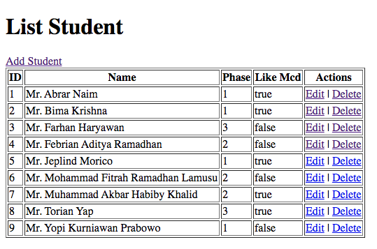
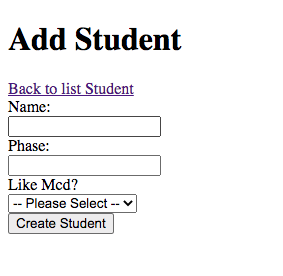
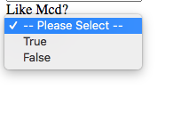
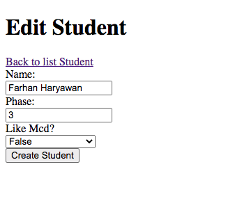
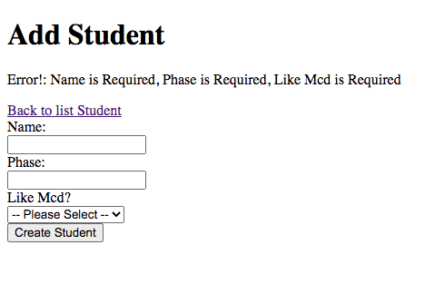

# Student Application

_⏰_ Time Estimation ~90 minutes

### Preparation Test Phase 1 Week 3

Sebuah perusahaan bootcamp meminta anda untuk membuat aplikasi yang dapat membaca, menambahkan, dan menghapus data student.

## Release 0
Buatlah *DATABASE* dengan menggunakan PostgreSQL dengan nama `dbstudentmcd`.
> Nama database WAJIB dbstudentmcd.

## Release 1
Buatlah file `setup.js` yang berfungsi untuk membuat table `Students` yang memiliki kolom-kolom sebagai berikut:

| Field         | Datatype | Modifiers   |
| ------------- | -------- | ----------- |
| id            | SERIAL   | PRIMARY KEY |
| name          | VARCHAR  | NOT NULL    |
| phase         | INTEGER  | NOT NULL    |
| likeMcd       | BOOLEAN  | NOT NULL    |

Jalankan file `setup.js` untuk membuat table `Students` di dalam database `dbstudentmcd`.

## Release 2
Buatlah file `seed.js` yang berfungsi untuk melakukan seeding data ke dalam table `Students` berdasarkan data dari `students.json`.

Jalankan file `seed.js` untuk melakukan seeding ke table `Students`.

## Release 3

Buatlah routing dengan menggunakan `ExpressJS` agar dapat melakukan CRUD operations dengan detail sebagai berikut:

| Method | Route             | Keterangan                                                                                                               |
| ------ | -----------------    | ------------------------------------------------------------------------------------------------------------------------ |
| GET    | /                    | Menampilkan semua student yang ada dalam database |
| GET    | /students/add        | Menampilkan halaman form untuk menambahkan data student |
| POST   | /students/add        | Menerima data yang dikirim dari halaman `/students/add` untuk melakukan _insertion_ ke dalam table `Students` |
| GET    | /students/edit/:id   | Menampilkan halaman form untuk mengedit data student |
| POST   | /students/edit/:id   | Menerima data yang dikirim dari halaman `/students/edit/:id` untuk melakukan _update_ ke dalam table `Students` |
| GET    | /students/delete/:id | Melakukan _delete_ data student berdasarkan `id` yang dikirimkan |

## Release 4
### Halaman Home atau Route `/`
Implementasikan routing `/` dengan membuat halaman `Home` dimana halaman ini menampilkan semua student yang ada pada database dalam bentuk list yang terdiri dari kolom ID, Name, phase, like Mcd, dan Actions.

Pada kolom action terdapat sebuah link yaitu `delete` yang akan mengarah ke `/students/delete/:id`.

Tambahkan `Mr.` pada data di kolom Name seperti pada screenshot contoh berikut:

### Halaman Add Student atau Route `/students/add`
Halaman add akan menampilkan form untuk memasukkan data student yang akan disimpan ke dalam database.

Untuk bagian `Like MCD` menggunakan select input yang terdapat 3 pilihan:
  - True
  - False

Apabila berhasil menambahkan student maka halaman akan redirect ke home atau `/`

## Release 5
### Halaman Edit Student atau Route `/students/edit/:id`
Halaman Edit akan menampilkan form yang telah terisi data student yang didapatkan dari database.

### Validasi Data Add atau Edit 
Halaman Add atau Edit akan menampilkan error dari data yang belum diisi (kosong).

Apabila berhasil menambahkan atau mengedit student maka halaman akan redirect ke home atau `/`

## Release 6
### Delete Student atau Route `/students/delete/:id`
Untuk mengimplementasikan routing ini, kamu tidak perlu membuat halaman baru, tapi cukup dengan menekan tombol delete yang akan mengarahkan routing ke `/students/delete/:id` dimana proses delete akan dilakukan berdasarkan `id` yang dikirimkan. 

Apabila berhasil menghapus student maka halaman akan redirect ke home atau `/`

**NOTE**
Untuk pesan error bisa ditampilkan dengan menggunakan `res.send`. Pesan error bebas selama yang ditampilkan jelas dan sesuai dengan error yang terjadi.
